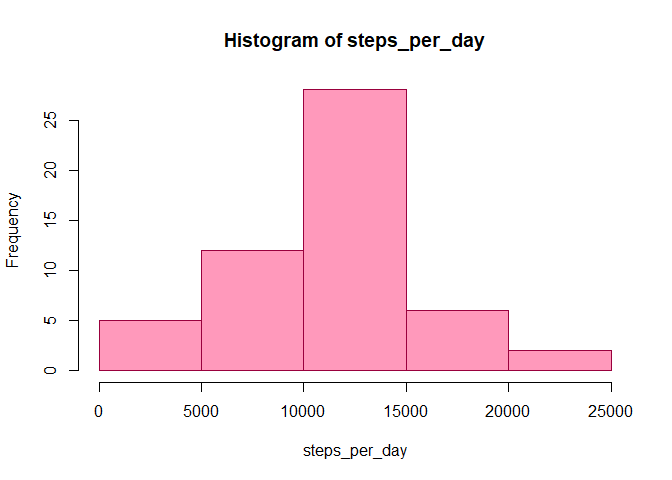
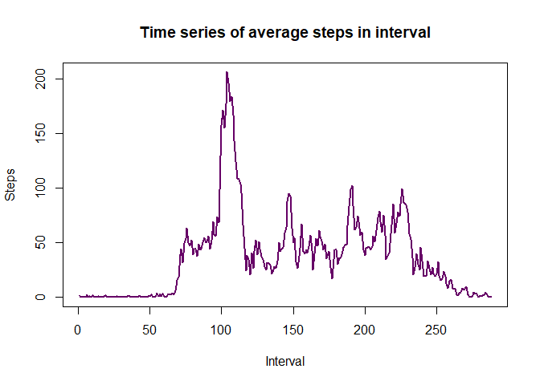
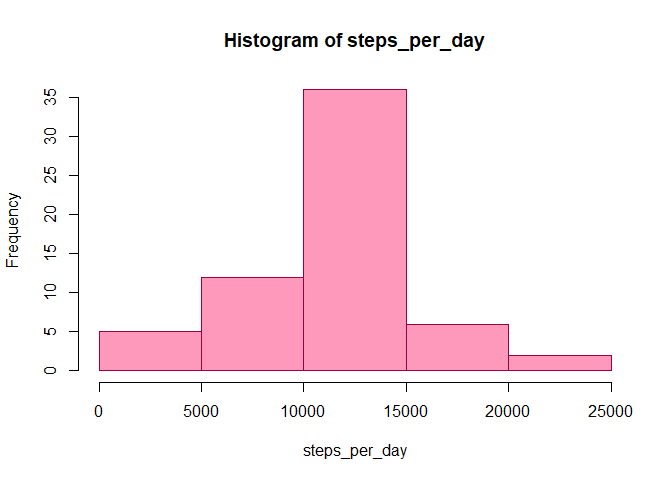
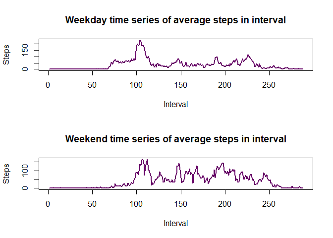

## Loading and preprocessing the data
Let us first read the data. We have to first unzip the data file in order to be
able to read it from R. As the data file is in .csv format, we will use read.csv
command.

```r
file <- "activity.zip"
data <- read.csv(unzip(file))
```
Let us take a quick look at our data.

```r
head(data)
```

```
##   steps       date interval
## 1    NA 2012-10-01        0
## 2    NA 2012-10-01        5
## 3    NA 2012-10-01       10
## 4    NA 2012-10-01       15
## 5    NA 2012-10-01       20
## 6    NA 2012-10-01       25
```
The data consists of three columns - steps, data & interval. 
We must have date column in proper format in order to process it effectively.
So, let us check it's class.

```r
class(data$date)
```

```
## [1] "character"
```
As we suspected, the date column is in character format. We should transform it
in Date format.

```r
data$date <- as.Date(data$date)
```
The data seems to be good for analysis now.
## What is mean total number of steps taken per day?
Let us first create an empty vector and append to it the total number of steps
corresponding to each day.

```r
steps_per_day <- vector()
dates <- unique(data$date)
for (date in dates) {
    d <- data[data$date == date, ]
    steps_per_day <- append(steps_per_day, sum(d$steps))
}
steps_per_day
```

```
##  [1]    NA   126 11352 12116 13294 15420 11015    NA 12811  9900 10304 17382
## [13] 12426 15098 10139 15084 13452 10056 11829 10395  8821 13460  8918  8355
## [25]  2492  6778 10119 11458  5018  9819 15414    NA 10600 10571    NA 10439
## [37]  8334 12883  3219    NA    NA 12608 10765  7336    NA    41  5441 14339
## [49] 15110  8841  4472 12787 20427 21194 14478 11834 11162 13646 10183  7047
## [61]    NA
```
Plotting the histogram of steps_per_day.

```r
hist(steps_per_day, col = "#ff99bb", border = "#99003d")
```

<!-- -->

Calculating mean and median of total number of steps taken per day.

```r
mean_of_steps <- mean(steps_per_day, na.rm = TRUE)
median_of_steps <- median(steps_per_day, na.rm = TRUE)
mean_of_steps
```

```
## [1] 10766.19
```

```r
median_of_steps
```

```
## [1] 10765
```
## What is the average daily activity pattern?
To inspect daily pattern of the steps taken, we have to create a vector with mean
steps across all the days for each interval.

```r
interval_avg_steps <- vector()
intervals <- 1:288
for (interval in intervals) {
    steps_in_interval <- vector()
    for (date in dates) {
        d <- data[data$date == date, ]
        steps_in_interval <- append(steps_in_interval, d$steps[interval])
    }
    interval_avg_steps <- append(interval_avg_steps, mean(steps_in_interval,
                                                          na.rm = TRUE))
}
```
Plotting the time-series graph.

```r
plot(intervals, interval_avg_steps, type = "l", col = "#660066",
     lwd = 2, main = "Time series of average steps in interval",
     ylab = "Steps", xlab = "Interval")
```

<!-- -->

To find which interval corresponds to highest no. of avg steps taken in a day.

```r
index = which.max(interval_avg_steps)
data$interval[index]
```

```
## [1] 835
```
Hence, subject on average takes highest number of steps in interval 8:35 to 9:00
per day. Perhaps, due to morning walk!
## Imputing missing values
To calculate number of missing values.

```r
dim(data[is.na(data), ])[1]
```

```
## [1] 2304
```
Filling missing values by corresponding avg steps in interval of the day.

```r
obs <- 1:dim(data)[1]
for (n in obs) {
    if (is.na(data$steps[n]) == TRUE) {
        if (n %% 288 == 0) {
            index = 288
        }
        else {
            index = n %% 288
        }
        data$steps[n] <- interval_avg_steps[index]
    }
    else {
        next
    }
}
```
creating the new dataset.

```r
new_data <- data
```
Calculating total number of steps taken per day.

```r
steps_per_day <- vector()
for (date in dates) {
    d <- data[new_data$date == date, ]
    steps_per_day <- append(steps_per_day, sum(d$steps))
}
steps_per_day
```

```
##  [1] 10766.19   126.00 11352.00 12116.00 13294.00 15420.00 11015.00 10766.19
##  [9] 12811.00  9900.00 10304.00 17382.00 12426.00 15098.00 10139.00 15084.00
## [17] 13452.00 10056.00 11829.00 10395.00  8821.00 13460.00  8918.00  8355.00
## [25]  2492.00  6778.00 10119.00 11458.00  5018.00  9819.00 15414.00 10766.19
## [33] 10600.00 10571.00 10766.19 10439.00  8334.00 12883.00  3219.00 10766.19
## [41] 10766.19 12608.00 10765.00  7336.00 10766.19    41.00  5441.00 14339.00
## [49] 15110.00  8841.00  4472.00 12787.00 20427.00 21194.00 14478.00 11834.00
## [57] 11162.00 13646.00 10183.00  7047.00 10766.19
```
Plotting the histogram of steps_per_day.

```r
hist(steps_per_day, col = "#ff99bb", border = "#99003d")
```

<!-- -->

Calculating mean and median of total number of steps taken per day.

```r
new_mean_of_steps <- mean(steps_per_day, na.rm = TRUE)
new_median_of_steps <- median(steps_per_day, na.rm = TRUE)
new_mean_of_steps
```

```
## [1] 10766.19
```

```r
new_median_of_steps
```

```
## [1] 10766.19
```
Comparing mean and median of this new dataset created by imputing missing values
to earlier data, we get both mean and median of the new dataset equal, which
states the new data is normally distributed.

## Are there differences in activity patterns between weekdays and weekends?
Mutating a new column in the dataset based on whether the day is weekday or not.

```r
day_column <- vector()
day_of_week <- weekdays(new_data$date)
for (day in day_of_week) {
    if (day %in% c("Saturday", "Sunday")) {
        value <- "weekend"
    }
    else {
        value <- "weekday"
    }
    day_column <- append(day_column, value)
}
new_data$day <- day_column
```
Making panel plot of weekday and weekend.

```r
days <- unique(new_data$day)
weekday_avg_steps <- vector()
weekend_avg_steps <- vector()
weekday <- new_data[new_data$day == "weekday", ]
weekend <- new_data[new_data$day == "weekend", ]
weekday_dates <- unique(weekday$date)
weekend_dates <- unique(weekend$date)
for (interval in intervals) {
    steps_in_interval <- vector()
    for (date in weekday_dates) {
        d <- weekday[weekday$date == date, ]
        steps_in_interval <- append(steps_in_interval, d$steps[interval])
    }
    weekday_avg_steps <- append(weekday_avg_steps, mean(steps_in_interval))
}
for (interval in intervals) {
    steps_in_interval <- vector()
    for (date in weekend_dates) {
        d <- weekend[weekend$date == date, ]
        steps_in_interval <- append(steps_in_interval, d$steps[interval])
    }
    weekend_avg_steps <- append(weekend_avg_steps, mean(steps_in_interval))
}
par(mfrow = c(2, 1))
plot(intervals, weekday_avg_steps, type = "l", col = "#660066",
     lwd = 2, main = "Weekday time series of average steps in interval",
     ylab = "Steps", xlab = "Interval")
plot(intervals, weekend_avg_steps, type = "l", col = "#660066",
     lwd = 2, main = "Weekend time series of average steps in interval",
     ylab = "Steps", xlab = "Interval")
```

<!-- -->

